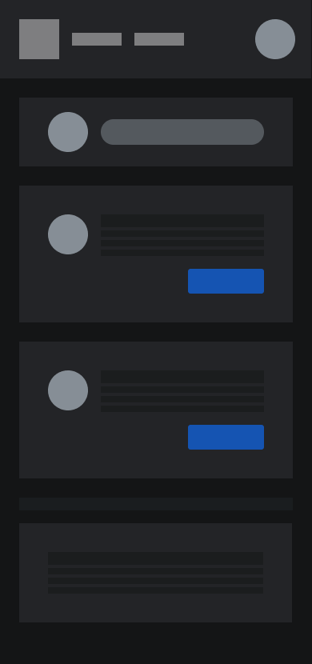
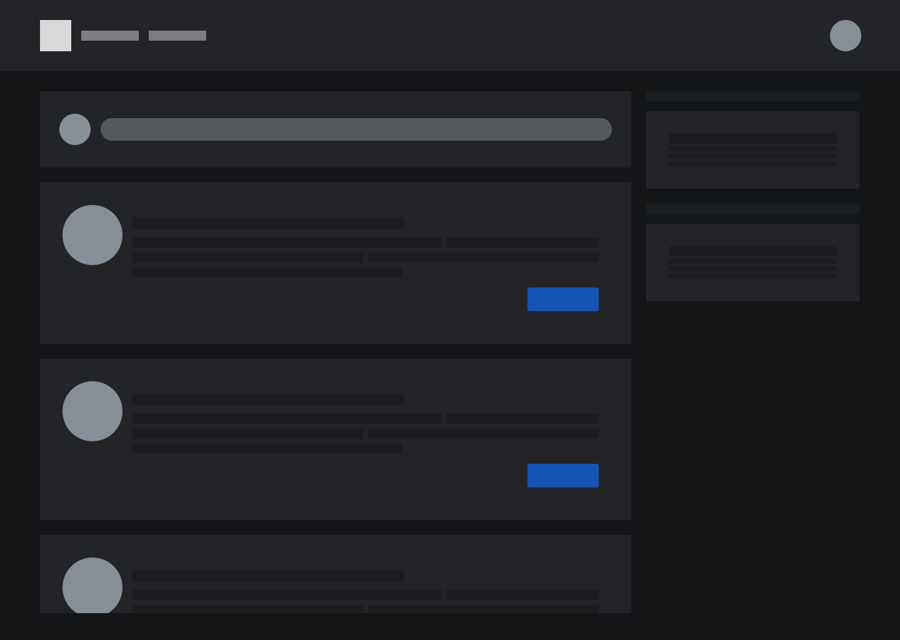
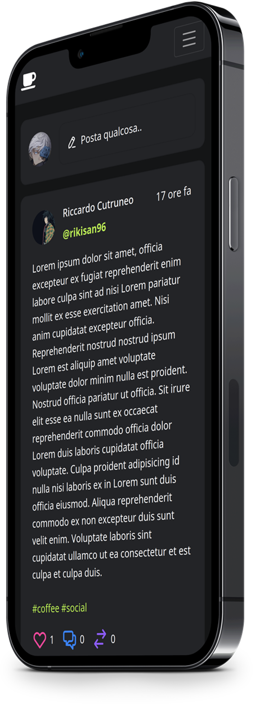

# Elaborato Tecnologie Web Francesco Raso francesco.raso@studio.unibo.it

Social network orientato alla discussione di argomenti di carattere generale.
La struttura del comment system è ispirata a [reddit](https://reddit.com), con commenti innestati e [thread](https://it.wikipedia.org/wiki/Thread_(comunicazione_online)).

## Design

## Tecnologie utilizzate

- Bootstrap 5.0 per il CSS
- jQuery per animazioni e interazioni client-side
- [Rive](https://rive.app): framework per la creazione di animazioni tramite un sistema di state machines. Utilizzato per creare il toggler del tema.

## Funzionalità

- In ogni post è possibile nascondere o espandere una gerarchia di thread tra i commenti
- Toggler animato per cambiare il tema da chiaro a scuro e il colore accent

Creazione di un post:

- Inserimento di testo e foto
- Video embedded da link di Youtube
- Inserire dei tag (con il simbolo #) all'interno post

## Utenti dummy

La query di creazione del database si trova nel file `database-structure.sql`

Di default il database è nominato `social`

email 

- francesco.raso@studio.unibo.it 
- cutrux@neo.it 
- meemmo@bivona.it 

password:

globit
